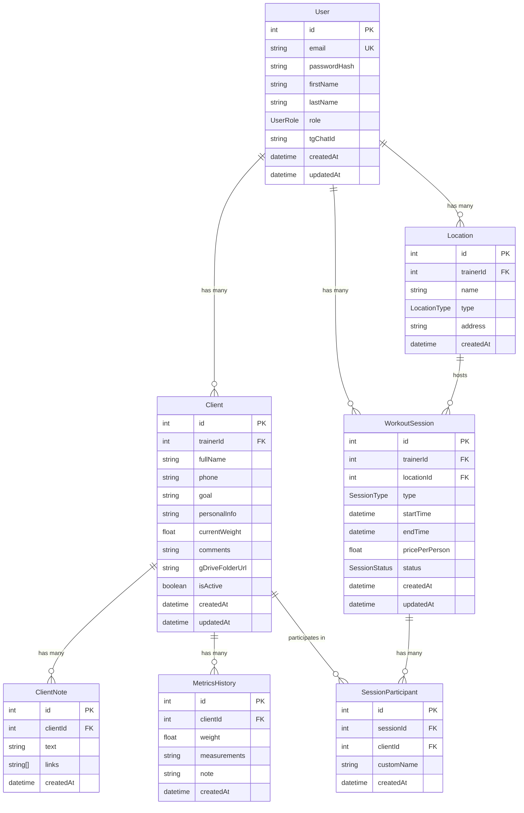

# FlowFit — Database Schema Documentation

## Entity Relationship Diagram



## Prisma Schema (Draft)

```prisma
generator client {
  provider = "prisma-client-js"
}

datasource db {
  provider = "postgresql"
  url      = env("DATABASE_URL")
}

enum UserRole {
  TRAINER
}

enum LocationType {
  STUDIO
  GYM
  OUTDOOR
}

enum SessionType {
  INDIVIDUAL
  GROUP
}

enum SessionStatus {
  UPCOMING
  ACTIVE
  REQUIRED_ACTION
  COMPLETED
  MISSED
}

model User {
  id           Int       @id @default(autoincrement())
  email        String    @unique
  passwordHash String
  firstName    String
  lastName     String
  role         UserRole  @default(TRAINER)
  tgChatId     String?

  clients      Client[]
  locations    Location[]
  sessions     WorkoutSession[]

  createdAt    DateTime  @default(now())
  updatedAt    DateTime  @updatedAt

  @@map("users")
}

model Client {
  id             Int       @id @default(autoincrement())
  trainerId      Int
  trainer        User      @relation(fields: [trainerId], references: [id], onDelete: Cascade)

  fullName       String
  phone          String?
  goal           String?
  personalInfo   String?
  currentWeight  Float?
  comments       String?
  gDriveFolderUrl String?
  isActive       Boolean   @default(true)

  notes          ClientNote[]
  metrics        MetricsHistory[]
  participations SessionParticipant[]

  createdAt      DateTime  @default(now())
  updatedAt      DateTime  @updatedAt

  @@index([trainerId])
  @@map("clients")
}

model ClientNote {
  id        Int      @id @default(autoincrement())
  clientId  Int
  client    Client   @relation(fields: [clientId], references: [id], onDelete: Cascade)

  text      String
  links     String[] @default([])

  createdAt DateTime @default(now())

  @@index([clientId])
  @@map("client_notes")
}

model MetricsHistory {
  id           Int      @id @default(autoincrement())
  clientId     Int
  client       Client   @relation(fields: [clientId], references: [id], onDelete: Cascade)

  weight       Float?
  measurements String?
  note         String?

  createdAt    DateTime @default(now())

  @@index([clientId])
  @@map("metrics_history")
}

model Location {
  id        Int          @id @default(autoincrement())
  trainerId Int
  trainer   User         @relation(fields: [trainerId], references: [id], onDelete: Cascade)

  name      String
  type      LocationType @default(STUDIO)
  address   String?

  sessions  WorkoutSession[]

  createdAt DateTime     @default(now())

  @@index([trainerId])
  @@map("locations")
}

model WorkoutSession {
  id             Int           @id @default(autoincrement())
  trainerId      Int
  trainer        User          @relation(fields: [trainerId], references: [id], onDelete: Cascade)
  locationId     Int
  location       Location      @relation(fields: [locationId], references: [id])

  type           SessionType   @default(INDIVIDUAL)
  startTime      DateTime
  endTime        DateTime
  pricePerPerson Float         @default(0)
  status         SessionStatus @default(UPCOMING)

  participants   SessionParticipant[]

  createdAt      DateTime      @default(now())
  updatedAt      DateTime      @updatedAt

  @@index([trainerId])
  @@index([trainerId, startTime])
  @@index([status])
  @@map("workout_sessions")
}

model SessionParticipant {
  id         Int      @id @default(autoincrement())
  sessionId  Int
  session    WorkoutSession @relation(fields: [sessionId], references: [id], onDelete: Cascade)
  clientId   Int?
  client     Client?  @relation(fields: [clientId], references: [id], onDelete: SetNull)

  customName String?

  createdAt  DateTime @default(now())

  @@index([sessionId])
  @@index([clientId])
  @@map("session_participants")
}
```

## Key Design Decisions

### Tenant Isolation
Every query MUST filter by `trainerId`. The `@@index([trainerId])` ensures fast lookups.

### Cascading Deletes
- Deleting a `User` cascades to all their Clients, Locations, and Sessions
- Deleting a `Client` cascades to their Notes, Metrics, and Participations
- Deleting a `WorkoutSession` cascades to its Participants
- Deleting a `Client` who is a `SessionParticipant` sets `clientId = null` (preserves the participation record with `customName` fallback)

### Computed Fields
- `WorkoutSession.totalPrice` = `pricePerPerson * participants.length` (not stored)
- `WorkoutSession` status is updated by cron (UPCOMING→ACTIVE→REQUIRED_ACTION) and manually (→COMPLETED/MISSED)

### Indexes
- `trainerId` on all tenant-scoped tables for fast filtered queries
- `(trainerId, startTime)` on `workout_sessions` for scheduler date-range queries
- `status` on `workout_sessions` for cron job filtering
